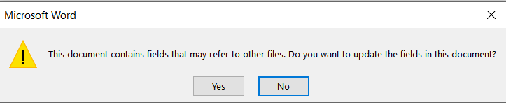
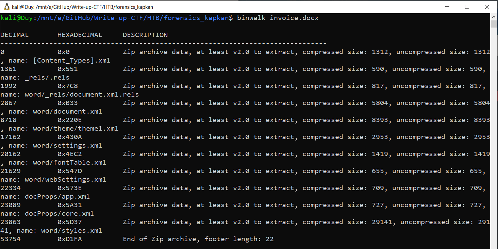
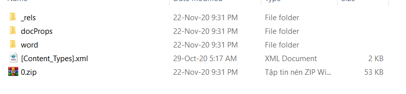
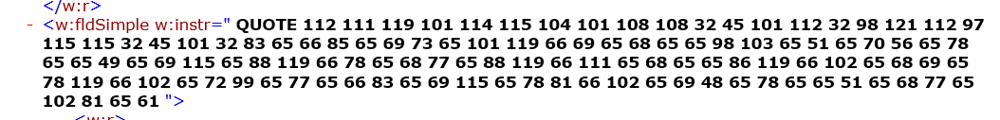

# kapkan
# TEAM : ζp33d_0∫_Ψ1m3

- Chall cho chúng ta 1 file zip giải nén ra ta được 1 file docx
- Mở file docx lên ta thấy có thông báo lỗi

- Về cấu trúc thì file docx khá giống với file zip, chứa những file XML dùng để config file docx
- Dùng binwalk để kiểm tra ta có được những file sau:

- Extract những file này bằng câu lệnh
```sh
	 binwalk -e invoice.docx
```
- Ta được folder như trong hình

- Vào folder word ta thấy file document.xml, mở file này lên ta thấy đoạn mã sau:

- Đoạn này gồm các số 32 -> 121, có khả năng là mã ASCII
- Mình viết nhanh 1 đoạn python để decode
```python
str = "112 111 119 101 114 115 104 101 108 108 32 45 101 112 32 98 121 112 97 115 115 32 45 101 32 83 65 66 85 65 69 73 65 101 119 66 69 65 68 65 65 98 103 65 51 65 70 56 65 78 65 65 49 65 69 115 65 88 119 66 78 65 68 77 65 88 119 66 111 65 68 65 65 86 119 66 102 65 68 69 65 78 119 66 102 65 72 99 65 77 65 66 83 65 69 115 65 78 81 66 102 65 69 48 65 78 65 65 51 65 68 77 65 102 81 65 61"
arr = str.split(" ")
msg = ''
for i in arr:
	msg += chr(int(i))

print(msg)
```

- Kết quả : powershell -ep bypass -e SABUAEIAewBEADAAbgA3AF8ANAA1AEsAXwBNADMAXwBoADAAVwBfADEANwBfAHcAMABSAEsANQBfAE0ANAA3ADMAfQA=

- Decode đoạn base64
```sh
echo SABUAEIAewBEADAAbgA3AF8ANAA1AEsAXwBNADMAXwBoADAAVwBfADEANwBfAHcAMABSAEsANQBfAE0ANAA3ADMAfQA= |base64 --decode
```
- Ta được flag: HTB{D0n7_45K_M3_h0W_17_w0RK5_M473}
