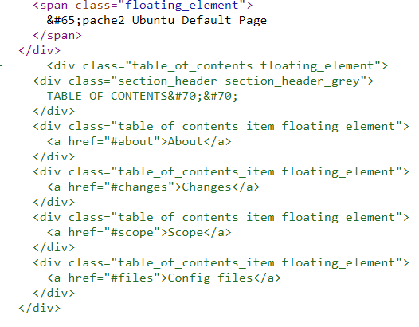

# sooodefault

- Vào trang web, ta có 1 trang apache2
- Từ tiêu đề challenge mình nghĩ có thể tác giả muốn
chúng ta đi tìm sự khác nhau giữa trang này so với những trang apache2 khác.
- Lúc đầu mở src lên xem thì thấy chẳng có j đặc biệt
kéo xuống đoạn comment thì thấy có kí tự bị encode HTMLentity
&#65;&#70;&#70;



decode thử thì được AFF (đúng với format AFFCTF) ==> lấy hết những kí tự encode này decode sẽ ra flag

```python
import requests,re

url = "http://web2.affinityctf.com/"
src = requests.get(url).text

pattern = r'&#(.*?);'
encoded = re.findall(pattern,src)

flag = ''

for c in encoded:
	flag += chr(int(c))

print("[+] Flag: ", flag)
```


==> Flag : AFFCTF{htmlentity}