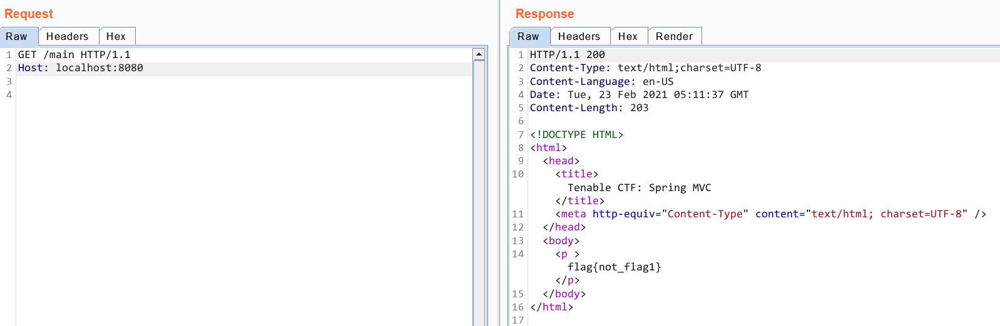
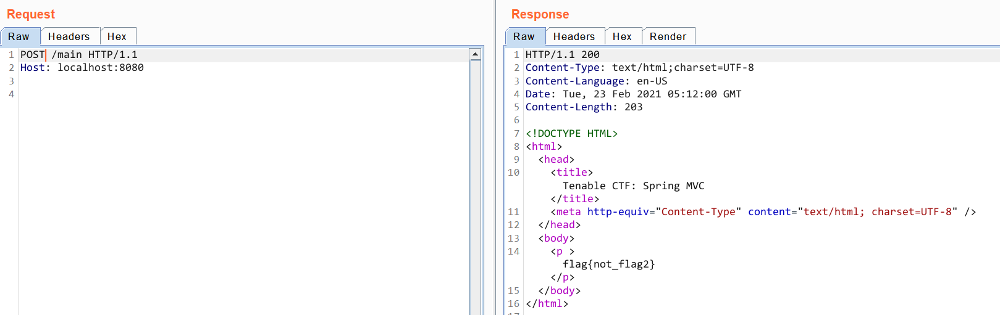
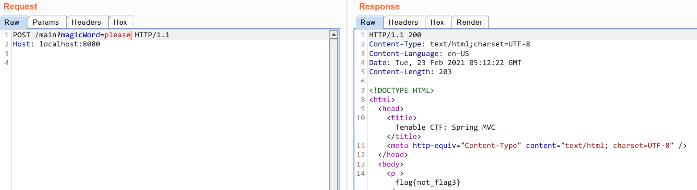
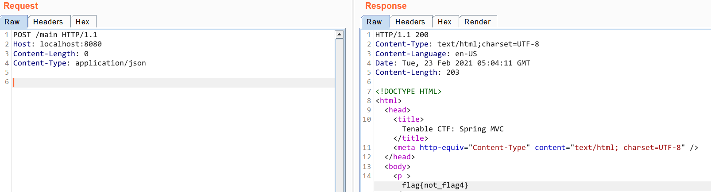
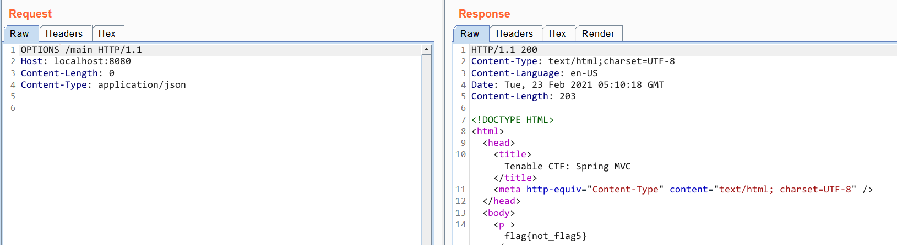
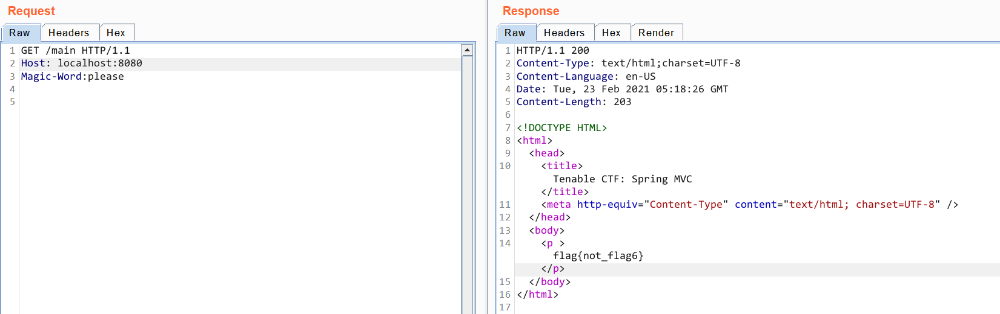

# Tenable - spring MVC 1->6
# TEAM : DUY - ζp33d_0∫\_Ψ1m3


Vì chall đã đóng nên bài này mình dựng lại local 
Mình để flag mặc định vì không có note lại flag @@@

- Chall MVC1:
Để tìm flag này ta xem qua code trong file Maincontroller.java
```java
	@GetMapping("/main")
        public ModelAndView getMain() {
		ModelAndView modelAndView = new ModelAndView("flag");
                modelAndView.addObject("flag", flags.getFlag("spring_mvc_1"));	// get main
                return modelAndView;
        }
```

@GetMapping("/main")
Bắt request truy cập vào {host}/main 

flags.getFlag("spring_mvc_1")
Thông qua class FlagService, biến flags sử dụng function getFlag("spring_mvc_1") được định nghĩa trong file FlagService.java
```java
public String getFlag(String flagName){...}
```

modelAndView.addObject("flag", flags.getFlag("spring_mvc_1"));
Đoạn này chỉ là gán object modelAndView = flag

Vậy ta truy cập vào {host}/main với phương thức GET thì server sẽ return lại object chứa flag 1



- Chall MVC2,MVC3:
```java
@PostMapping("/main")
    public String postMain(@RequestParam(name="magicWord", required=false, defaultValue="") String magicWord, Model model) {
		if (magicWord.equals("please"))
			model.addAttribute("flag", flags.getFlag("spring_mvc_3"));	// post main param 
		else
            model.addAttribute("flag", flags.getFlag("spring_mvc_2"));	// post main

        return "flag";
    }
```
Tương tự để lấy được flag 2 thì ta gởi method POST tới {host}/main 


magicWord.equals("please")
Đoạn này so sánh tham số được post lên  magicWord === 'please'
Vậy ta POST lên {host}/main với tham số magicWord=please thì sẽ được flag 3


- Chall MVC4:
```java
@PostMapping(path = "/main", consumes = "application/json")
	public String postMainJson(Model model) {
                model.addAttribute("flag", flags.getFlag("spring_mvc_4"));	// post main flag json
                return "flag";
        }
```
consumes = "application/json"
Đoạn này check content-type trong header request

POST lên với content-type là application/json ta được flag 4


- Chall MVC5:
```java
@RequestMapping(path = "/main", method = RequestMethod.OPTIONS)
        public String optionsMain(Model model) {
                model.addAttribute("flag", flags.getFlag("spring_mvc_5"));	// options main
                return "flag";
        }
```
@RequestMapping đây là annotation trong spring mvc với phương thức bất kỳ (flexible method)

method = RequestMethod.OPTIONS
Đoạn này check xem request được gởi lên có phải là method OPTIONS hay không
Gửi request với method là OPTIONS lên ta được flag 5

- Chall MVC6:
```java
@RequestMapping(path = "/main", method = RequestMethod.GET, headers = "Magic-Word=please")
        public String headersMain(Model model) {
                model.addAttribute("flag", flags.getFlag("spring_mvc_6"));	// headers main
                return "flag";
    }
```
Tương tự ta gởi request với method là GET là headers là Magic-Word:please sẽ được flag 6
